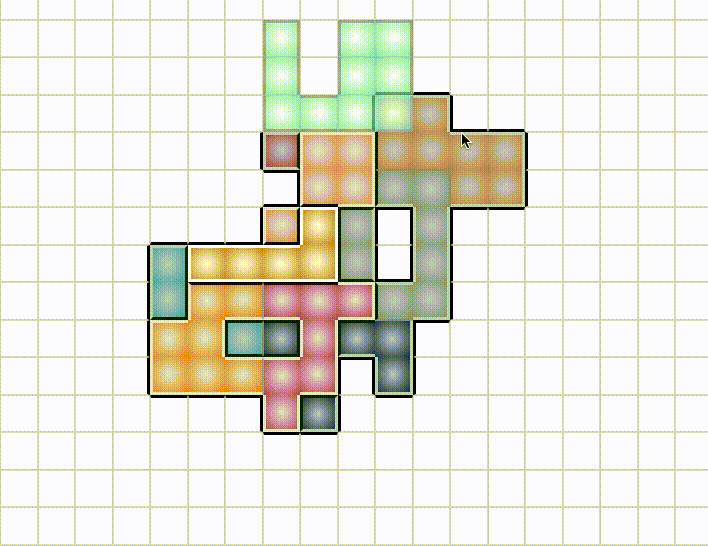
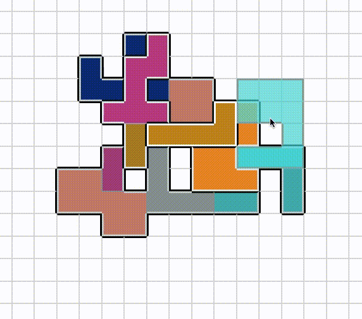
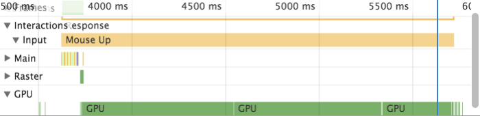
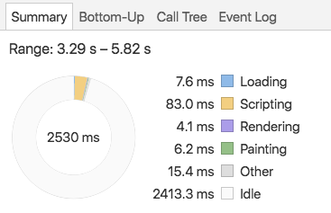

# Debugging CSS Performance

## This Blog Post is Not About React

I have been playing around with React recently. It's an interesting framework with a lot to offer in terms of ease-of-development, maintainability and performance, and it's been exciting to give it a spin. It's certainly a very different environment than Backbone, the front-end framework with which I am most familiar.

My most recent project has been a clone of [NMBR-9](https://boardgamegeek.com/boardgame/217449/nmbr-9), a wonderful board game I've been enjoying lately. It's sort of like Tetris, except you stack the tiles vertically and get points based on how tall you build it. The rules aren't very complex and it takes place on a square grid, which makes it perfectly suited to rendering with HTML and CSS. I figured it would be an excellent way to cut my React teeth.

And yet with hardly any work done I was running into performance problems. Notice how the currently selected shape lags behind the cursor.



Some of you old web hands have probably already figured out what the problem is and are sitting there chuckling to yourselves. But my background is in systems programming - for most of my professional career I've worked on computers that don't even have screens. So for me, this was an Interesting Engineering Challenge&trade;.

## Measuring Performance


### Profiling Tools

There's an old adage in the business world that applies equally well to software: "if you can't measure it, you can't improve it". This means I needed to be able to do two things:

1. Figure out what part of the process is taking so long. This provides a target for improvement efforts.
1. Put a number on how long it takes to render a frame - that is, go from mouse movement to pixels on the screen. This will allows one build to be compared to another in absolute terms, answering the question, "did I actually make things better?"

For the first I used Chrome's builtin performance profiler, which provides a beautiful visual representation of what functions are running when. [Google has an good tutorial](https://developers.google.com/web/tools/chrome-devtools/evaluate-performance/reference) if you're not familiar with the tool.

For the second I had to build some tooling myself. The browser provides a function, [`requestAnimationFrame()`](https://developer.mozilla.org/en-US/docs/Web/API/window/requestAnimationFrame), which takes a function to call the next time it's ready to draw a frame; that is, once the current frame has finished drawing. Usually `requestAnimationFrame()` is used for, well, animation, but I co-opted it for my own purposes. By putting a call to it in React's `render()` function, I was able to measure how long it takes to go from `render()` to the finished DOM.

```javascript
render() {
  const renderStartTime = performance.now();
  requestAnimationFrame(() => {
    const delta = performance.now() - renderStartTime;
    console.log(`render to RAF: ${delta} ms`);
  });

  // ... do render things ...
}
```

I could have used [`console.time()`](https://developer.mozilla.org/en-US/docs/Web/API/console#Timers) here instead of [`performance.now()`](https://developer.mozilla.org/en-US/docs/Web/API/Performance/now), but I like having direct access to the number, in case I want to take averages or something like that. The only way to get the elapsed time from `console.time()` is by reading it with your human eyes.

### The Experiment

I also needed a consistent experiment to run, so that my trials would be as controlled as possible. Otherwise it could be random chance that made performance better or worse, rather than some "improvement" I had made. This means I needed a repeatable starting state, and a repeatable set of inputs to test.

To get a starting state, I played the game to about midway through, then used the Chrome console and `JSON.stringify()` to get a representation of the game's state. Copy-paste it into a call to `JSON.parse()` in the constructor for the top-level component and I was good to go.

For the experiment, I needed to be able to provide a "random" but repeatable set of mouse movements, a random walk across the game board. Unfortunately vanilla JavaScript doesn't allow you to seed the random number generator, but there exists a library called [seedrandom](https://github.com/davidbau/seedrandom) that allows you to do exactly that. Here's the random walk function I came up with:

```javascript
startRandomWalk() {
  this.renderTimes = [];
  this.setMouseLocation(10, 10);
  const interval = 100;

  Math.seedrandom('random but predictable sequence');
  let steps = 0;
  const MAX_STEPS = 100;
  const intervalId = setInterval(() => {
    let row = this.state.mouse.row;
    let col = this.state.mouse.col;
    if (Math.random() * 2 > 1) {
      if (row === 0 || (row < this.state.boardHeight - 1 && Math.random() * 2 > 1)) {
        row += 1;
      } else {
        row -= 1;
      }
    } else {
      if (col === 0 || (col < this.state.boardWidth - 1 && Math.random() * 2 > 1)) {
        col += 1;
      } else {
        col -= 1;
      }
    }
    console.log(`Step ${steps}: moving mouse to ${row}-${col}`);
    this.setMouseLocation(row, col);

    steps += 1;
    if (steps > MAX_STEPS) {
      clearInterval(intervalId);
    }
  }, interval);
}
```

`setMouseLocation()` is the same function I pass into child components to call when they get moused over, so this is as close as I can get to the full sequence without mocking up DOM events. All I had to do was wire it up to a `<button>` and I was ready to get started.

## Trying Things Out

With tooling in place, now it was time to start running tests. Looking at the Chrome performance tree didn't reveal any obvious hot-spots - I was spending a lot of time in various opaquely named React functions, but there wasn't a clear busy-loop somewhere in my code taking up all the time. Alas.

However, React does a lot of work by itself. Every time you re-render it rebuilds some portion of the shadow DOM and diffs it with the real thing. I figured this would be a great opportunity to experiment and find out what kinds of operations are slow and what are fast.

My plan was to start with small changes like messing with styles, and move towards big changes requiring me to restructure the whole app.

### Trial 1: Removing Inline CSS

Inline CSS?!?! Yeah, I'm not proud. It's just so easy to do in React, and you're already defining all your HTML inside your JavaScript, so why not take it one step further? Well performance, for one reason. By my metrics I got about a 15-20% speedup by removing most of my inline CSS. It was a change I knew I needed to make at some point, so it was good to see my instincts confirmed.

This also correlates with [the literature](https://www.ctheu.com/2015/08/17/react-inline-styles-vs-css-stupid-benchmark/). We're doing a lot more processing work than they were, so a little less of a difference makes sense.

### Trial 2: Removing Computation-Intensive Styles

In looking for other easy things to change (and dreading a major refactor of my app) I stumbled upon [this SO post](https://stackoverflow.com/questions/5793586/how-does-the-performance-of-using-background-gradients-in-css-vs-using-images) claiming that gradients are really slow. Easy enough to test:

```
s/background: radial-gradient\(white, (.*)\);/background-color: $1;/g
```



Look at how snappy that is! Almost all the visual lag is immediately gone (scroll up and compare with the first gif, it's a huge difference). It doesn't look quite as good as it did before, but now that I know gradients are off-limits I'm sure I'll figure something out.

But the numbers... nothing has changed. Not a single millisecond more or less. That means `requestAnimationFrame()` isn't telling the whole story.

## Simplification

Armed with some evidence and a theory, the consummate scientist has no choice but to attempt to prove themselves wrong. To falsify their hypothesis. So I set out to construct a perfect scenario to test whether gradients are really that bad for performance. No React, no complicated board state, just a big grid full of colored squares and a little bit of profiling.

This is what I came up with: the [CSS Gradient Test](https://droberts-ada.github.io/css-gradient-test/) ([source code](https://github.com/droberts-ada/css-gradient-test)). Load it and be amazed: on my 2015 MacBook the gradient version takes whole seconds to re-render, while the solid version (using the exact same code) is practically instant.

Moreover, looking at the console reveals a similar story around the `requestAnimationFrame()` timing: it's about the same for both versions, and is obviously much, much shorter than the time it takes to render the gradient version.

To understand why, let's dig deeper into the story told by the Chrome dev tools.



This image is from me profiling the gradient version. Notice the long green line at the bottom labeled "GPU". Chrome will send computationally expensive things like rendering gradients to the GPU. On my MacBook that's not a particularly impressive piece of hardware, and so it takes a while (I later ran the same test on my gaming desktop at home and saw much better performance).

To understand why `requestAnimationFrame()` is firing whole seconds before the frame actually appears on the screen, we can look at another part of the performance tab, the summary pie chart. This is the summary from the same time period.



Note that there's no "GPU" category, just two and a half seconds of idle time. As far as Chrome is concerned, as soon as one frame is sent to the CPU it's ready to start work on the next. In the vast majority of cases this is the correct assumption, but here we have created a worst-case-scenario where the GPU work is far more expensive than anything happening in the main processor.

It's worth noting that the difference between CPU and GPU work is very obvious in this pathological scenario. In my NMBR-9 implementation it was small enough that I managed to overlook it at first. Even if I had seen it at the beginning, I would have needed to conduct a similar sequence of tests to find the problem.

## Takeaways

- Using Chrome's performance profiler provides a way better developer experience than messing around with valgrind
    - There's still a bit of a learning curve
    - Even the most excellent tooling has blind spots
- The same performance tuning principles apply equally well to systems programming and webdev:
    - Measuring is key, both relatively (what piece of this is slow) and absolutely (did this change make a difference)
    - To make sure you can trust your results, have a consistent experiment to run and control for as much as possible
- I wrote this blog post after solving the problem, which might make it look like it was easy. In reality there were many hours of research, confusion, head-scratching and hard work to come to these conclusions. Also, I'm sure that my techniques could be improved!
- Huge thanks to Charles for letting me bounce endless ideas off him
